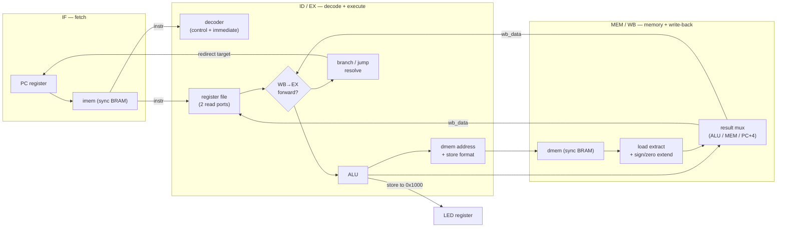
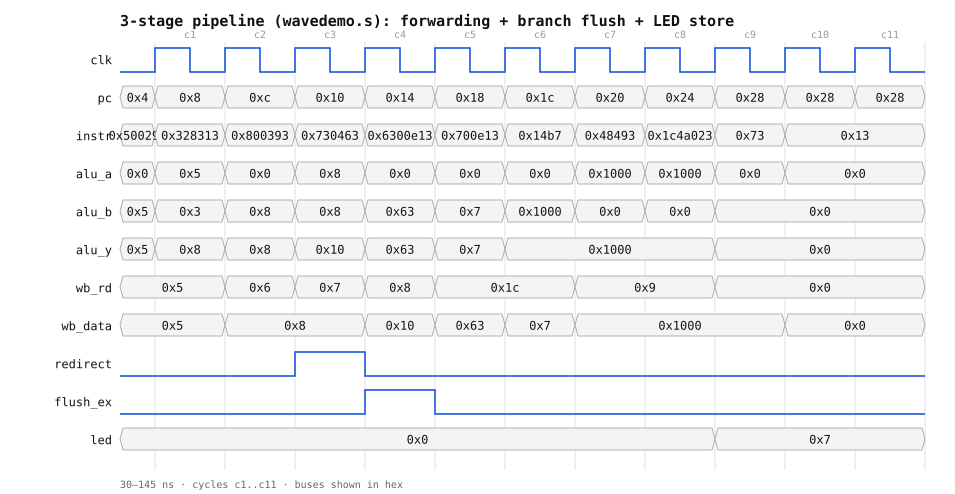
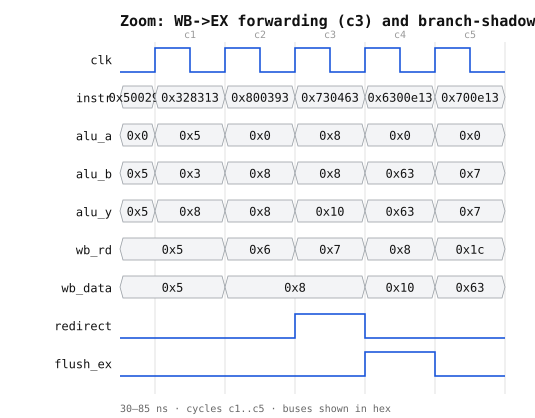

# How the CPU works, stage by stage (with real waveforms)

This is a visual companion to [`ARCHITECTURE.md`](ARCHITECTURE.md). It walks
through the datapath one stage at a time, then shows the two trickiest
mechanisms — **operand forwarding** and the **branch-shadow flush** — happening
in an actual simulation, cycle by cycle.

The waveforms are rendered straight from a Vivado `xsim` VCD dump by
`scripts/vcd2svg.py` (no external tools), so every value shown is real and any
reviewer can regenerate the figures from the committed `sim/waves/wavedemo.vcd`.

---

## 1. The datapath

The core is three pipeline stages between the program counter and the register
file write-back:



Key points that make it only three stages:

- The instruction memory is a **synchronous** BRAM, so its output register *is*
  the IF/ID boundary — no separate fetch register is needed.
- Decode, register read, the ALU, branch resolution, and the data-memory
  address all happen in **one** combinational stage (ID/EX).
- The data memory is addressed at the end of ID/EX; its registered read data
  lands in MEM/WB the next cycle.

---

## 2. Instructions flowing through the pipeline

Because there are three stages, three instructions are in flight at once. This
reservation table shows instructions `I0..I2` fetched back-to-back:

| cycle | IF (fetch) | ID/EX (decode+exec) | MEM/WB (mem+write) |
|---|---|---|---|
| C0 | I0 | | |
| C1 | I1 | I0 | |
| C2 | I2 | I1 | I0 |
| C3 | I3 | I2 | I1 |

The consequence: when `I1` is in ID/EX (reading registers), its predecessor
`I0` is in MEM/WB producing a result that **has not yet been written** to the
register file. That is the hazard the forwarding path exists to solve.

---

## 3. The two hard mechanisms, seen in simulation

The program `sim/programs/wavedemo.s` was written to make both mechanisms
visible in a dozen cycles:

```asm
    addi t0, x0, 5      # t0 = 5
    addi t1, t0, 3      # t1 = t0 + 3   <- needs t0 forwarded, = 8
    addi t2, x0, 8      # t2 = 8
    beq  t1, t2, taken  # 8 == 8  -> TAKEN: redirect + squash next
    addi t3, x0, 99     # SHADOW  -> flushed, never commits
taken:
    addi t3, x0, 7      # t3 = 7
    li   s1, 0x1000     # LED address
    sw   t3, 0(s1)      # show 7 on the LEDs
    ecall               # halt
```

### Full run



### Zoom on the hazard cycles



### Cycle-by-cycle (real values from the VCD)

| cyc | instr in EX | disassembly | what to notice |
|---:|---|---|---|
| c2 | `0x00500293` | `addi t0,x0,5` | produces `t0=5` (in WB next cycle) |
| **c3** | `0x00328313` | `addi t1,t0,3` | **`alu_a = 5` is forwarded** from `wb_data=5` (`wb_rd=5=t0`), *not* the stale register file; `alu_y = 8` |
| c4 | `0x00800393` | `addi t2,x0,8` | `t2 = 8` |
| **c5** | `0x00730463` | `beq t1,t2,taken` | `alu_a=8, alu_b=8` → equal → **`redirect=1`**; PC is steered to `taken` |
| **c6** | `0x06300e13` | `addi t3,x0,99` (shadow) | already fetched, but **`flush_ex=1`** squashes it — it never writes `t3` |
| c7 | `0x00700e13` | `addi t3,x0,7` (target) | redirect worked; `alu_y=7` |
| c8–c10 | `0x000014b7 …` | `li s1,0x1000` / `sw` | address `0x1000` computed |
| c11 | `0x00000073` | `ecall` | halts; `led` now shows **`0x0007`** from the store |

Two things to take away from the trace:

1. **Forwarding needs no stall.** At c3 the dependent instruction gets its
   operand the same cycle the producer is in write-back. This works even for
   loads, because the data-memory read is a *registered* value that is stable
   for the whole MEM/WB cycle.
2. **A taken branch costs exactly one cycle.** The branch is resolved in EX
   (c5); the one instruction already fetched behind it (c6) is squashed; the
   target runs at c7. One bubble, no more.

---

## 4. Reproduce the figures

```bash
# 1. run the demo and dump a VCD
scripts/run_sim.sh sim/tb_wave.v sim/programs/wavedemo.s   # writes wave.vcd
cp build/sim/wave.vcd sim/waves/wavedemo.vcd

# 2. render SVGs from the VCD (pure-Python, no deps)
python scripts/vcd2svg.py sim/waves/wavedemo.vcd \
  --signals clk pc instr alu_a alu_b alu_y wb_rd wb_data redirect flush_ex led \
  --start 30 --end 145 --out docs/figures/pipeline_waveform.svg \
  --title "3-stage pipeline: forwarding + branch flush + LED store"
```

`scripts/vcd2svg.py --list sim/waves/wavedemo.vcd` prints the available signal
names. Buses are shown in hex; 1-bit signals as square waves; light vertical
lines mark clock cycles.
